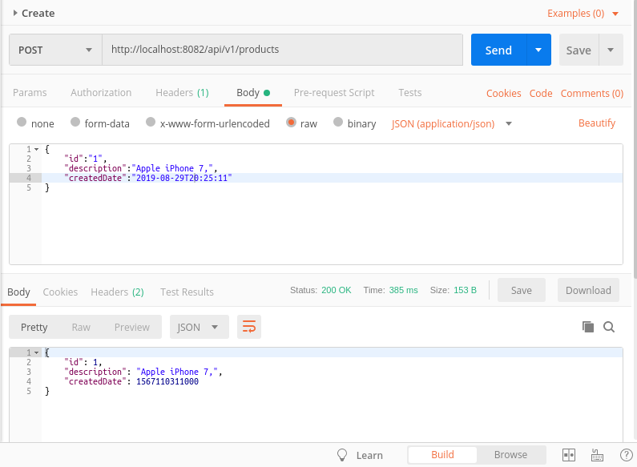
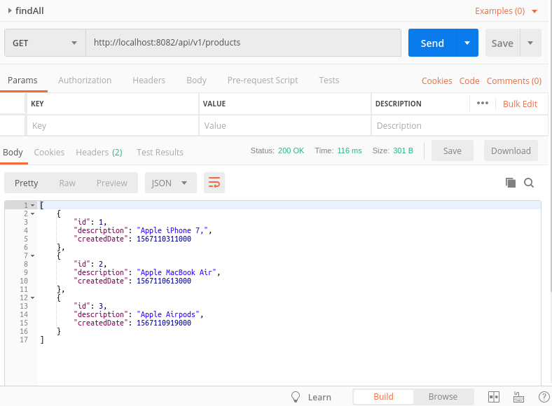
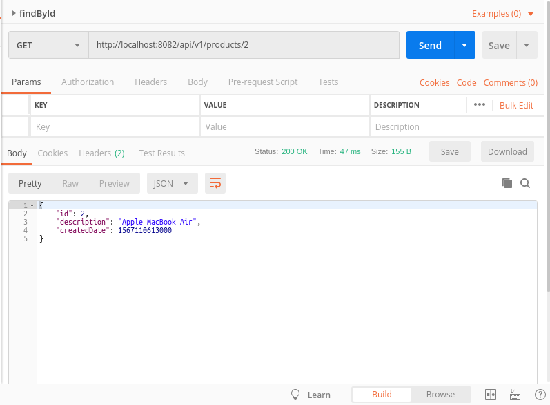
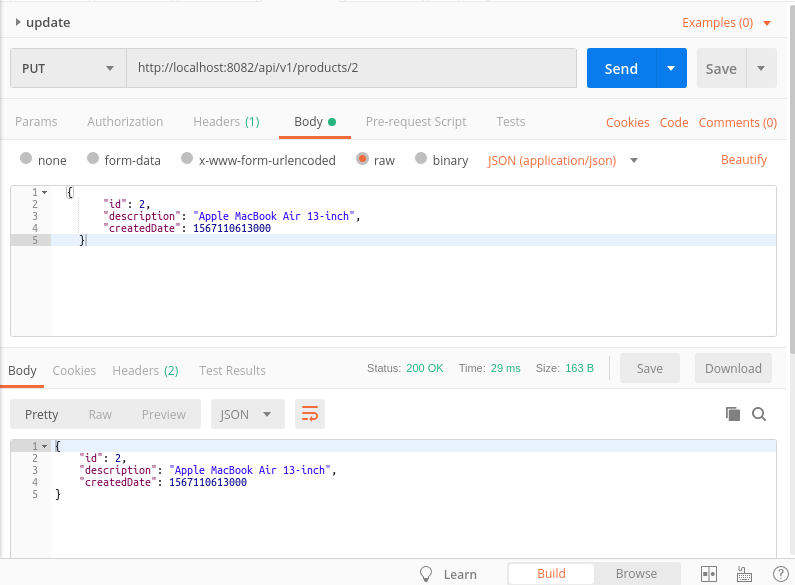

# Example Reactive programming with Spring Boot

## 1.- Create docker container of Reactive MongoDB

docker run  -p 27017:27017 bitnami/mongodb:latest

## 2.- Create database store

use store

## 3.- Configure application.properties

server.port=8082

spring.data.mongodb.database=store

spring.data.mongodb.host=localhost

spring.data.mongodb.port=27017

## 4- Start the application

#### create: http://localhost:8082/api/v1/products

#### findAll: http://localhost:8082/api/v1/products

#### findById: http://localhost:8082/api/v1/products/2

#### update: http://localhost:8082/api/v1/products/2

